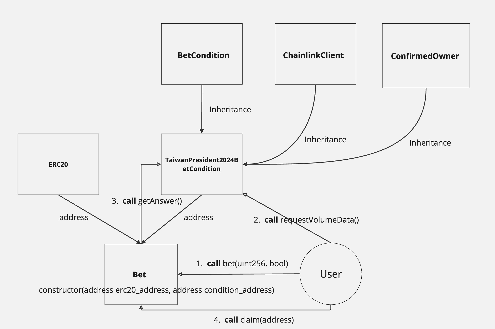

## Betting smart contract
Users can use this contract to set betting conditions for a wager. The steps to use it are as follows:

1. Inherit the `BetCondition` contract and create your own betting condition contract, `{YouOwn}BetCondition`. Define the achievement logic and set the end time.
2. Create a Bet contract by inputting the ERC20 token address you want to use as a bet and the address of the newly created condition contract.
3. Users interact with the `Betting` contract to place bets.
4. When the settlement time is exceeded, anyone can call `Bet.finish()` to settle the results.
5. Use `Bet.Claim(address)` to help the winner claim their rewards.
6. The reward calculation formula (using the example where the final condition is true) is:
     - `User bet Amount on true` / `Total amount bet on true` * `Total amount bet on false`.


## Flowchart


## Example (Deployed on Sepolia testnet)

### TaiwanPresident2024BetCondition
- Description：Will Lai Ching-te be the next president of Taiwan?
- Contract Address： `0x41Bdeb82C86465758721fF7AcF57cb63D2d1215D`
- End_time： 2024/01/14 00:00:00 (+08:00)  The day after Taiwan Presidential Election Voting Day
- Action: Use chainlink to get offchain data to return the result

### Betting
- Contract Address： `0xFD65Bc601BC31fA4dd9e0Faa6252815fBb9796A6`
- ERC20 address:  WETH `0x7b79995e5f793A07Bc00c21412e50Ecae098E7f9`
- Condition Contract address: `0x41Bdeb82C86465758721fF7AcF57cb63D2d1215D`

## Usage

### Build

```shell
$ forge build
```

### Deploy

```shell
$ ETHERSCAN_API_KEY=your_own_api_key
$ forge script --rpc-url https://sepolia.gateway.tenderly.co script/deployTaiwanPresident2024Bet.s.sol:deployTaiwanPresident2024BetConditionScript --verify --etherscan-api-key $ETHERSCAN_API_KEY --broadcast
```

## Test

```shell
$ forge test -vv
```
